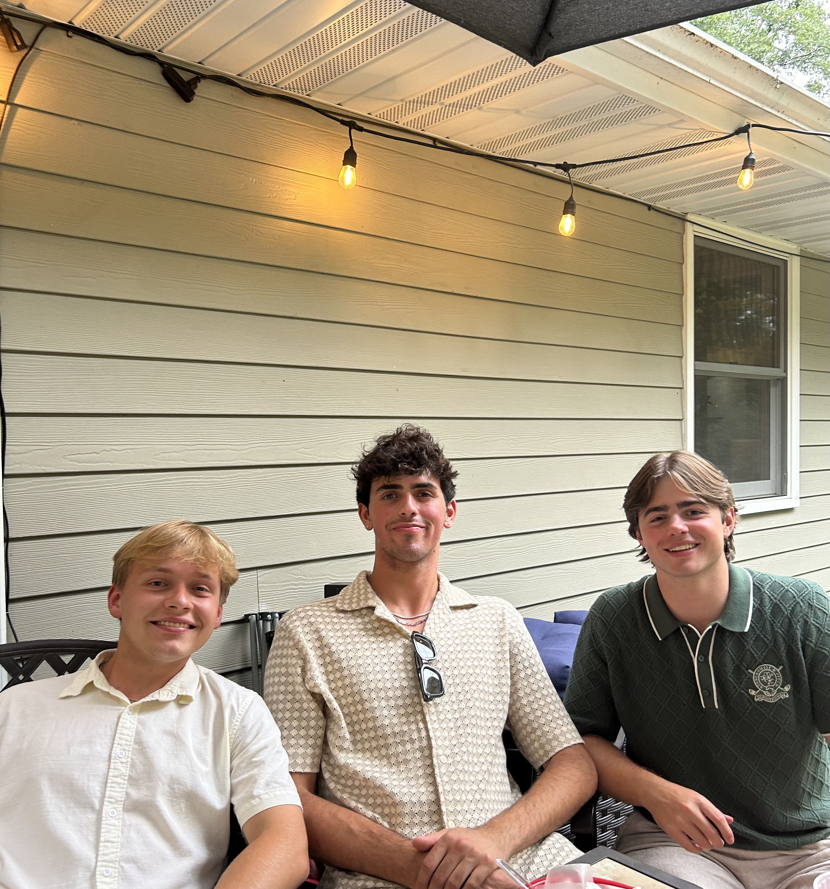
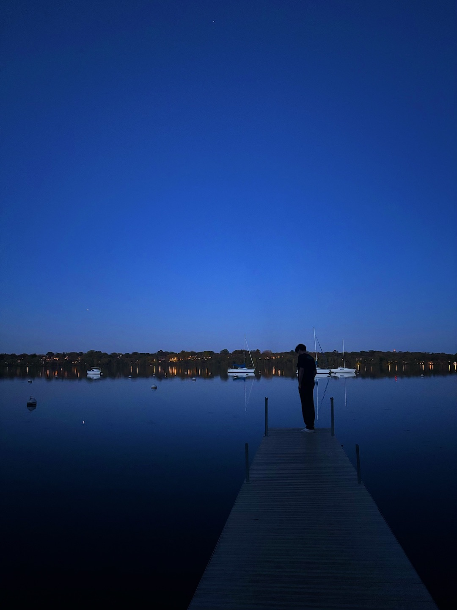
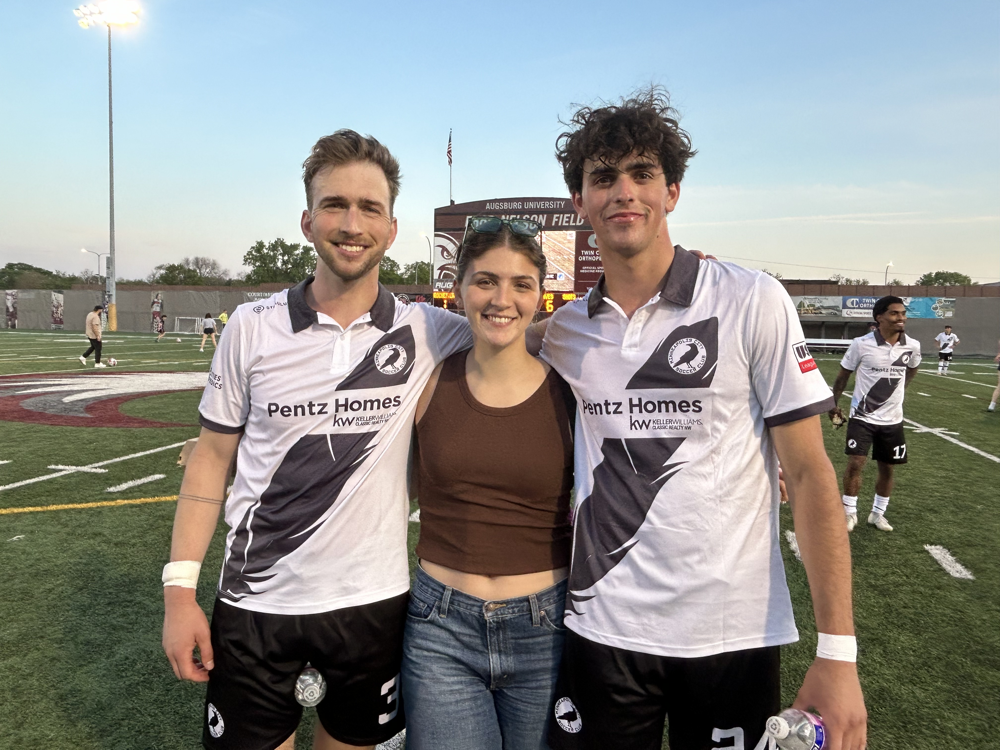

::: {.welcome-page}

<div class="hero">
  <div class="hero-text">
    <h1>Hi, I'm Nick Kent</h1>
    <p>
      Welcome to my personal website, built with <strong>Quarto</strong> in <strong>R/RStudio</strong>.
      I am a junior at Macalester College majoring in <strong>statistics</strong>, with minors in
      <strong>computer science</strong> and <strong>economics</strong>.
    </p>
    <p>
      I enjoy data exploration and analysis across a variety of topics, and I hope to continue
      growing my skill set. Feel free to look through this website to learn more about me and my work.
    </p>
  </div>

  <div class="hero-image">
```{r, echo=FALSE, out.width='220px', fig.align='center'}
knitr::include_graphics("Headshot.jpg")
```

</div> </div> <div class="section"> <h2>Soccer</h2> <p> I spend a lot of time playing soccer. During the fall and most of the school year, I compete as a member of the Macalester College men's soccer team. Over the summer, I play with Minneapolis City Soccer Club. </p> </div> <div class="image-grid two">   </div> <div class="section"> <h2>Outside of School</h2> <p> I also enjoy spending time outdoors with friends and family and trying new restaurants. Some of my favorite places to hang out in Minneapolis are the lakes, including Harriet, Bde Maka Ska, Cedar, and Isles. </p> <p> I also enjoy restaurants such as Black Sheep Pizza, World Street Kitchen, Quang, and Andale Taqueria. </p> </div> <div class="image-grid four">     </div>

:::